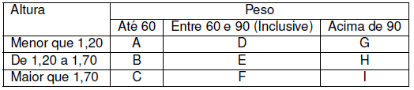

<h1 align="center">
    
</h1>

    <h3> 🔵 Sétima Lista 🔵 </h3>
    
     
    

## Lista 7

Lista de exercícios para praticar algoritmo estruturado e lógica de programação.

## Questões

1.	Efetuar a leitura de três valores e apresentar como resultado final a soma dos quadrados dos três valores lidos.

2.	Ler o valor do raio de um círculo e calcular a área do círculo correspondente. A área do círculo é π * raio2, considere π = 3,141592.

3.	Faça um programa que receba três números e mostre-os em ordem crescente.

4.	Faça um programa que receba a altura e o peso de uma pessoa. De acordo com a tabela a seguir, verifique e mostra qual a classificação dessa pessoa. 

<h1 align="center">
    
</h1>
 
5.	Faça um programa que calcule e mostre a soma dos 50 primeiros números pares.

6.	Faça um programa que receba vários números, calcule e mostre:
a.	A soma dos números digitados
b.	A quantidade de números digitados
c.	A média dos números digitados
d.	O maior número digitado
e.	O menor número digitado
f.	A média dos números pares
•	Finalize a entrada de dados caso o usuário informe o valor 0. 

7.	Faça um programa para ler a nota da prova de 15 alunos e calcule e imprima a média geral.

8.	Faça um programa que receba do usuário dois arrays, A e B, com 10 números inteiros cada. Crie um novo array C calculando C = A - B. Mostre na tela os dados do array C.

9.	Faça um programa em que troque todas as ocorrências de uma letra L1 pela letra L2 em uma string. A string e as letras L1 e L2 devem ser fornecidas pelo usuário 

10.	Faça um programa que receba do usuário uma string. O programa imprime a string sem suas vogais. 

11.	Faça um programa que contenha um menu com as seguintes opções:
a.	Ler uma string S1 (tamanho máximo 20 caracteres);
b.	Imprimir o tamanho da string S1;
c.	Comparar a string S1 com uma nova string S2 fornecida pelo usuário e imprimir o resultado da comparação;
d.	Concatenar a string S1 com uma nova string S2 e imprimir na tela o resultado da concatenac¸ ˜ao;
e.	Imprimir a string S1 de forma reversa;
f.	Contar quantas vezes um dado caractere aparece na string S1. Esse caractere desse ser informado pelo usuário;
g.	Substituir a primeira ocorrência do caractere C1 da string s1 pelo caractere C2. Os caracteres C1 e C2 serão lidos pelo usuário;
h.	Verificar se uma string s2 é substring de s1. A string s2 deve ser informada pelo usuário;
i.	Retornar uma substring da string s1. Para isso o usuário deve informar a partir de qual posição deve ser criada a substring e qual é o tamanho da substring.

12.	Faça um programa no qual o usuário informa o nome do arquivo, e uma palavra, e retorne o número de vezes que aquela palavra aparece no arquivo.

13.	Faça um programa em C que recebe como entrada o nome de um arquivo de entrada e o nome de um arquivo de saída. Cada linha do arquivo de entrada possui colunas de tamanho de 30 caracteres. No arquivo de saída dever ser escrito o arquivo de entrada de forma inversa. Veja um exemplo:
Arquivo de entrada:
Hoje é dia de prova de AP
A prova está muito fácil
Vou tirar uma boa nota

Arquivo de saída: 
PA ed avorp ed aid é ejoH. 
Licáf otium átse avorp A
Aton aob amu rarit uov

## 🛠️ Linguagem

💻 C

### ☑️ Código:

## 🌟 CEFET / RJ

Essa lista foi passada no meu curso de Sistemas de Informação realizado no CEFET.

